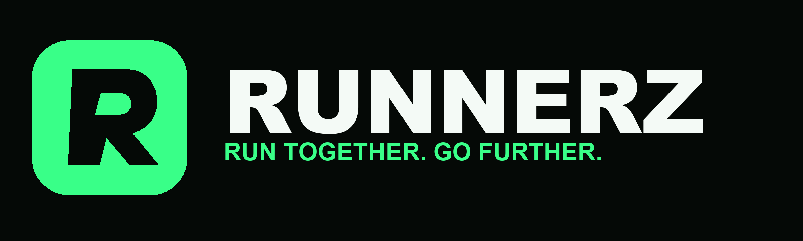
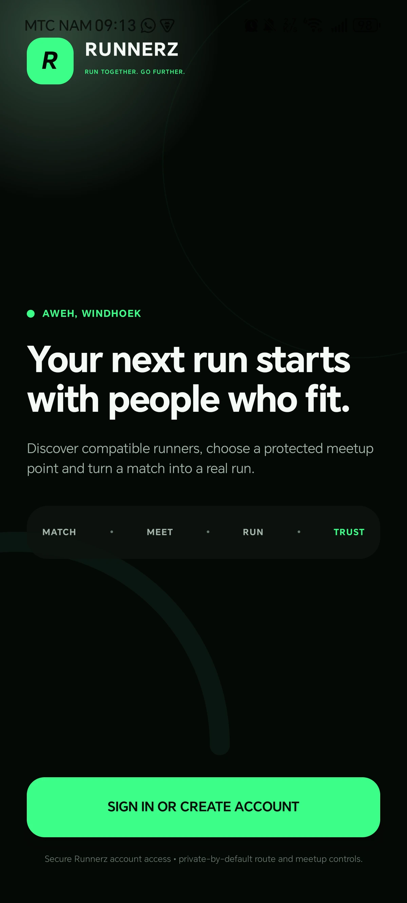
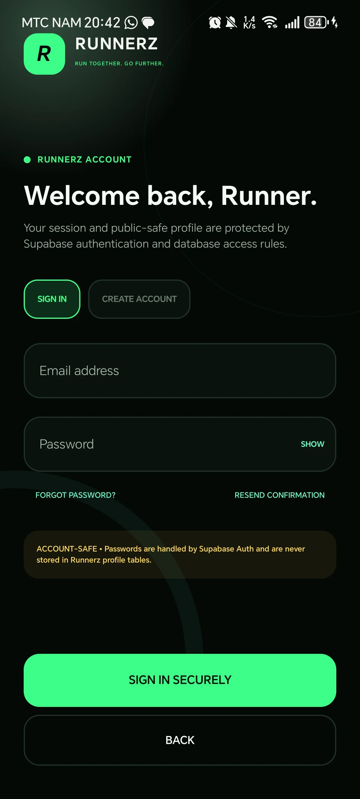
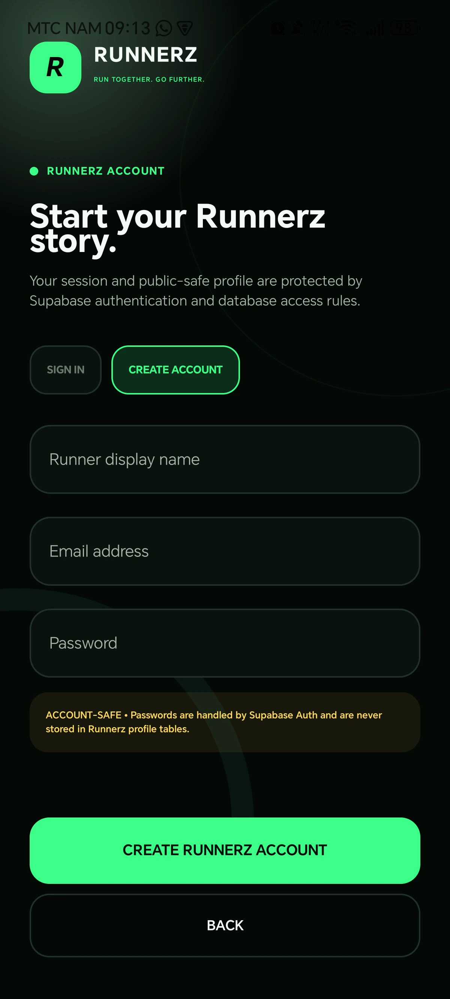
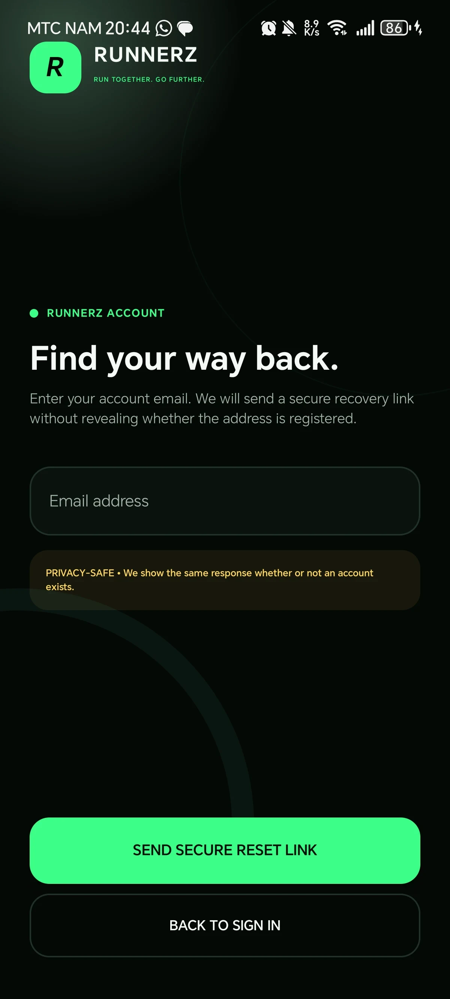
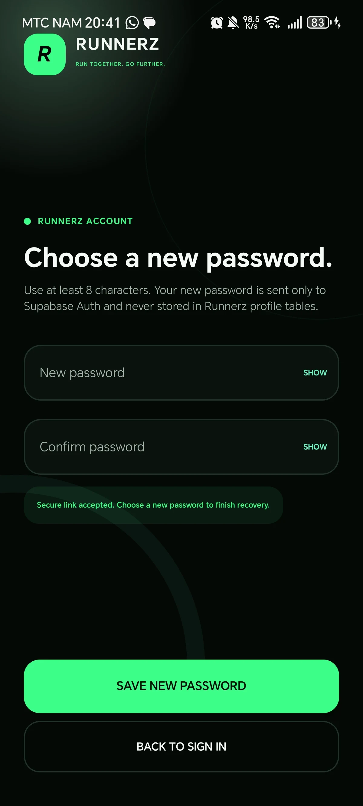
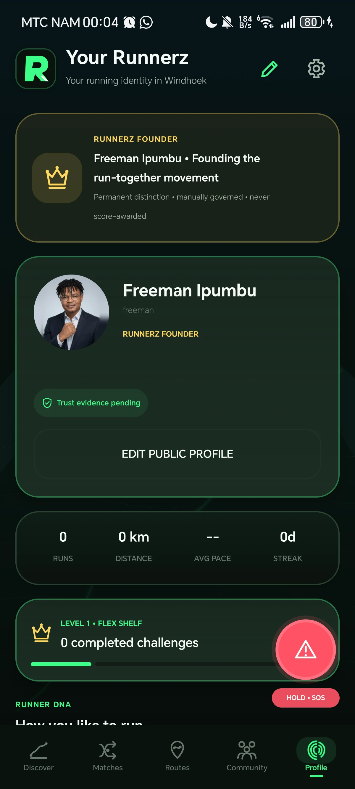
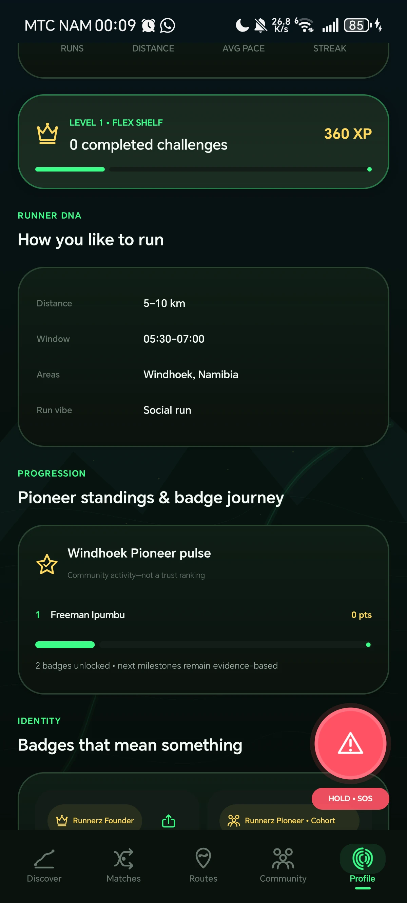

# Runnerz Namibia — Website & Route Lab Case Study



**The public launch surface for a Windhoek-first social running network.**

[Runnerz Namibia](https://runnerznamibia.com) · [Android product case study](https://github.com/freeman-ipumbu/runnerz-android-case-study)

> This repository is a presentation-safe product record. The website source, server routes, infrastructure, provider configuration and operational controls remain private.

## My role

**Freeman Ipumbu — Founder, product builder and design researcher**

I designed and built the complete launch experience: product positioning, responsive interface, Windhoek Route Lab, self-hosted map stack, weather integration, Insider conversion flow, social pathways, safety wording, performance work and production-readiness foundation.

## The brief

The website had to make an unfamiliar product understandable in seconds while still proving that Runnerz had real depth behind the campaign language.

The result combines a human launch story with a working route-discovery surface. Visitors can understand the social loop, explore real Windhoek route studies and decide whether the community is for them without being buried in product mechanics.

## Experience highlights

- Cinematic Windhoek launch direction grounded in the actual city.
- Searchable Route Lab with 24 distinct BRouter/OpenStreetMap geometry and elevation studies.
- Route-specific pages with distance, climb, terrain context and honest field-check status.
- Self-hosted MapLibre basemap using a compact Windhoek PMTiles archive.
- Suggested public meetup options ranked by true nearest-route distance.
- Live MET Norway weather and conservative warm/high-UV guidance.
- A real Android gallery rather than speculative phone mockups, including ranked meetup options, a live Founder portrait, governed recognition and the native share-card studio.
- Production-shaped Insider registration with validation, consent and truthful delivery states.
- Founder-only operations command with live product signals, a structured Insider workflow, audit-ready exports and accountable follow-up states.
- Privacy, support, terms, safety and account-deletion routes.
- Mobile-hardened Route Lab, navigation and gallery behaviour with reduced-motion handling.
- Metadata, sitemap, security headers and production health checks.

## Live product proof

The website now presents the production-shaped Android account journey alongside the wider Runnerz product story.

| Welcome | Secure sign-in | Create account |
|---|---|---|
|  |  |  |

| Password recovery | Authenticated password update |
|---|---|
|  |  |

| Live Founder profile | Governed recognition | Privacy-safe share studio |
|---|---|---|
|  |  |  |

| Ranked meetup options on the live route map |
|---|
|  |

An older completion capture has been retired from the gallery while revised timer-only completion wording awaits a new physical-device screenshot. Planned route distance is not presented as verified kilometres banked.

## Product atmosphere


The visual system uses near-black, electric green, white and mint with a restrained gold signal. It is performance technology with Namibian warmth—not generic fitness imagery or imported cyberpunk decoration.

## Route Lab


The public catalogue includes route studies across Avis, Eros, Olympia, Brakwater, Windhoek Central, Auasblick, Ludwigsdorf, Katutura, Khomasdal, Dorado Park, Pioneerspark, Suiderhof, Kleine Kuppe, Academia, Hochland Park and Cimbebasia.

Geometry is genuine routed open data. Access, lighting, water, road conditions and safety remain explicitly marked for local field verification.

## Engineering overview

- React 19 and TypeScript
- Vinext and Vite
- MapLibre with self-hosted PMTiles, fonts and sprites
- Protomaps/OpenStreetMap attribution and BRouter route studies
- DigitalOcean App Platform deployment behind Cloudflare DNS and edge controls
- Responsive route metadata and map rendering
- Content Security Policy and conservative browser-security headers
- Optimised WebP media and deferred below-the-fold assets
- Structured consent, duplicate prevention and abuse-protection foundations
- Named-operator authorization and database-enforced multi-factor assurance
- Private workflow state with append-only, cryptographically linked audit evidence

## Operations is part of the product

Launching the public surface created a second design problem: interest is only useful if the team can act on it responsibly.

I designed Runnerz Command as a deliberately single-account control room for the Founder. It turns Insider demand, live community signals and follow-up decisions into one restrained operational workflow. Each contact can be reviewed, prioritised, scheduled and annotated; operational and audit datasets can be exported without exposing any management surface to ordinary Runnerz accounts.

The control model is defence in depth: a valid account, an explicit private allowlist and a fresh authenticator-backed session are all required. The data layer rejects password-only sessions even if the interface is bypassed. Contact details remain with the email provider while the database stores only the minimum workflow state needed for accountable operations.

## Design science loop

```text
LOCAL PROBLEM → PRODUCT THESIS → INTERACTIVE ARTEFACT →
BROWSER + DEVICE EVALUATION → SAFETY CORRECTION → HARDENED RELEASE
```

## Current status

The official website is live at [runnerznamibia.com](https://runnerznamibia.com). Its production verification suite covers public routes, legal and support pages, security headers, health/weather contracts, sitemap coverage, route studies, PMTiles byte-range delivery, canonical host behaviour and anonymous rejection at the operations boundary.

The Route Lab exposes 24 distinct Windhoek studies while keeping field verification explicit. The Insider journey has validation and confirmation mail, and the product gallery uses physical-device captures spanning signup and recovery, ranked meetup-map options, an owner-controlled Founder profile, governed recognition and privacy-safe square/Story exports.

September registration hardening makes required device choices explicit and replaces a silently disabled submit button with actionable guidance. Security-check expiry and loading failures have a visible retry path; optional WhatsApp consent remains optional. Automated tests exercise valid platform choices, Namibian-number validation, mandatory consent, security rejection and duplicate registration with external delivery mocked. Those tests do not substitute for real production delivery checks.

The registration correction is deployed. Its local handler suite passed six checks and the deployed website passed 53 public-route, health and security-contract checks. A real-mail signup acceptance check remains separate from that result.

## Repository boundary

No application source, PMTiles archive, environment file, API implementation, production identifier, subscriber data or deployment configuration is included here.

Security concerns should be sent privately to [info@runnerznamibia.com](mailto:info@runnerznamibia.com).

---

© 2026 Runnerz Namibia. Product and brand material is shared for portfolio viewing. No licence is granted to reproduce the product, identity or documentation.
