# Runnerz Namibia — Website & Route Lab Case Study


**The public launch surface for a Windhoek-first social running network.**

[Runnerz Namibia](https://runnerznamibia.com) · [Android product case study](https://github.com/freeman-ipumbu/runnerz-android-case-study)

> This repository is a presentation-safe product record. The website source, server routes, infrastructure, provider configuration and operational controls remain private.

## My role

**Freeman Ipumbu — Founder, product builder and design researcher**

I designed and built the complete launch experience: product positioning, responsive interface, Windhoek Route Lab, self-hosted map stack, weather integration, Insider conversion flow, social pathways, safety wording, performance work and production-readiness foundation.

## The brief

The website had to make an unfamiliar product understandable in seconds while still proving that Runnerz had real depth behind the campaign language.

The result combines a human launch story with a working route-discovery surface. Visitors can understand the social loop, explore real Windhoek route studies and decide whether the community is for them without being buried in product mechanics.

## Experience highlights

- Cinematic Windhoek launch direction grounded in the actual city.
- Searchable Route Lab with 27 distinct BRouter/OpenStreetMap geometry and elevation studies.
- Route-specific pages with distance, climb, terrain context and honest field-check status.
- Self-hosted MapLibre basemap using a compact Windhoek PMTiles archive.
- Suggested public meetup options ranked by true nearest-route distance.
- Live MET Norway weather and conservative warm/high-UV guidance.
- A real Android gallery rather than speculative phone mockups, including ranked meetup options, a live Founder portrait, governed recognition and the native share-card studio.
- Production-shaped Insider registration with validation, consent and truthful delivery states.
- Founder-only operations command with live product signals, a structured Insider workflow, audit-ready exports and accountable follow-up states.
- Live privacy, support, terms, safety and account-deletion routes, including a
  public deletion-request path and an in-app Settings path for signed-in
  runners.
- Mobile-hardened Route Lab, navigation and gallery behaviour with reduced-motion handling.
- A persistent hamburger control keeps the full Runnerz navigation one tap away across phone, tablet and desktop widths, while the direct link row remains available on larger screens.
- Metadata, sitemap, security headers and production health checks.
- A product update section for the Android 1.1.0 / code 15 source-and-build
  candidate: accepted-fix map follow, a full-span segmented `#39FF88` trail,
  elapsed time, distance, current/average pace, estimated elevation gain,
  durable account-scoped Banked Miles, minimised Android workout controls,
  broad-area Running Nearby and an explicit music handoff. Final outdoor and
  handset acceptance remain open.
- Route-selected starts and separate expanded-map ME, ROUTE, PREV and NEXT
  controls. Route proximity is guidance only: Runnerz never snaps the recorded
  GPS trail or banked distance onto a planned route.
- A women-centred programme story covering invitation-led women-only runs,
  women-led all-welcome sessions, beginner circles and daylight route checks.
  Optional self-reported identity stays private, is never inferred or
  published, and never replaces host approval.
- Account-level block/report controls, current-document legal reacceptance and
  a fail-closed account surface when required acceptance cannot be verified.
- Opt-in Running Nearby cards use only a broad area and short-lived presence;
  they expose no coordinates, exact distance, direction, pace or trail.
- A `Coming soon` gallery presenting the complete 21-product concept collection across hydration, headwear, movement essentials, carry/keepsakes, club travel and the original three-tee range. Five catalogue image families replace the earlier three-item preview, while vehicle graphics remain clearly identified as launch-support artwork. A consented product-interest signal captures demand without making a payment, preorder, price, stock or allocation promise.
- A dedicated Official Runnerz Music Player story and separate UNIFIED ×
  Runnerz digital promo inside the merch area, now centred on UNIFIED 20.0
  Signal Command while staying outside the 21-item physical catalogue.
- A new community-ecosystem bridge introduces Magic Boys Football Academy through its live privacy-first website without presenting the academy and Runnerz as the same initiative.

## Ambassador and culture layer


The public product story now introduces Shadrac “ShowTime” Mavungu as an official Runnerz Brand Ambassador. His original Runnerz track and planned Didi-led content are described as work in development; no sponsor or featured artist is presented as confirmed before an agreement exists.

## Official Runnerz Music Player

| Retained Momentum Engine evidence | Retained Next Move evidence | Retained Listening Season card |
|---|---|---|
| 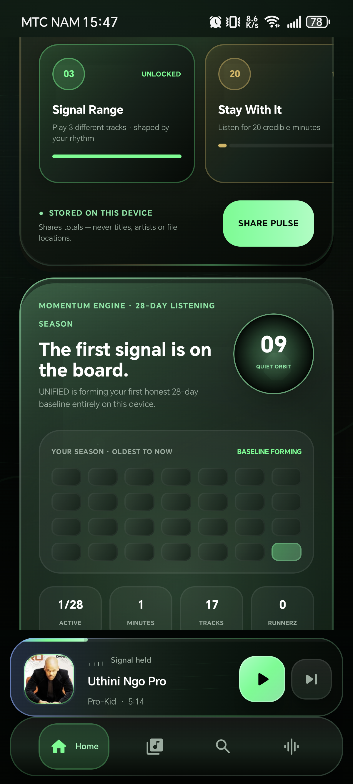 | 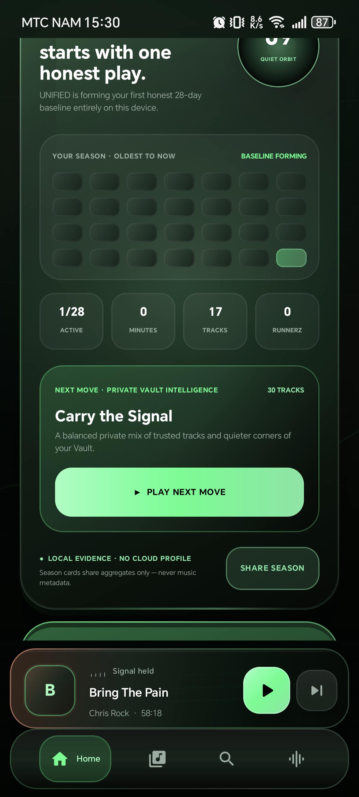 | 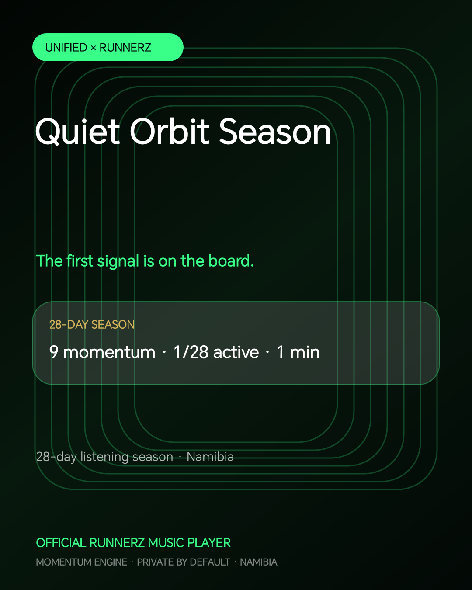 |

*These are genuine earlier 15.0 handset captures retained to document the
product's design lineage. They do not depict the current UNIFIED 20.0 Signal
Command deck or final Runnerz 1.1.0 handset acceptance.*

The website gives **UNIFIED × Runnerz** its own ecosystem story rather than
presenting music as a generic external-app button. The current public story is
UNIFIED 20.0 Signal Command: a local-first system with a real Command Deck,
five evidence-led Smart Spaces, a checksum-protected Capsule and reversible
Queue Director controls. It retains the 3,795-track local Vault, thirty-five
earned badges, adaptive missions, private 28-day Listening Season and playable
artist-diversified Next Move established by the earlier evidence set.

Runnerz 1.1.0 detects a supported UNIFIED installation locally and keeps the
suggestion inside the explicit music action and Settings. An explicitly armed
session carries only bounded soundtrack/session context; track identities and
listening history stay in UNIFIED, while exact route data stays in Runnerz. An
armed session expires, can be cancelled, and returns only aggregate completion
metadata after Runnerz observes and banks a run. The complete start/run/return
round trip and production signing trust remain acceptance gates rather than a
production-ready claim.

The website promotion also keeps the commercial and rights boundaries visible:
the player is a separate digital product rather than a paid order or a 22nd
physical item, and provider playback still requires registered infrastructure.
ShowTime Radio's metadata matches are not treated as music-rights approval. The
supplied Runnerz ambassador portrait is bundled for presentation; no artist
audio or remote stream is bundled. Listening share output contains aggregate
evidence rather than track titles, artists or file paths.

## Community ecosystem bridge

The public Runnerz story now links directly to [Magic Boys Football Academy](https://magicboys.pages.dev/). The bridge is framed around the shared value of movement, discipline and belonging rather than a fabricated product integration. It also carries the academy’s safeguarding boundary into the link story: no player names or personal details about minors are published, and enquiries route through the adult academy contact.

## Live product proof

The website presents the production-shaped Android account journey alongside
the wider Runnerz product story. The earlier images below are physical
field-test captures retained as product-history evidence. The final image is
a controlled 1.1.0 simulation on a physical handset; it is not final outdoor
acceptance.

| Welcome | Secure sign-in | Create account |
|---|---|---|
| 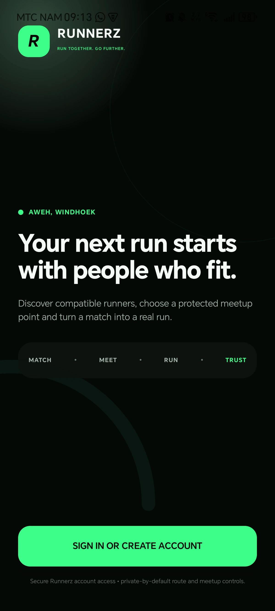 | 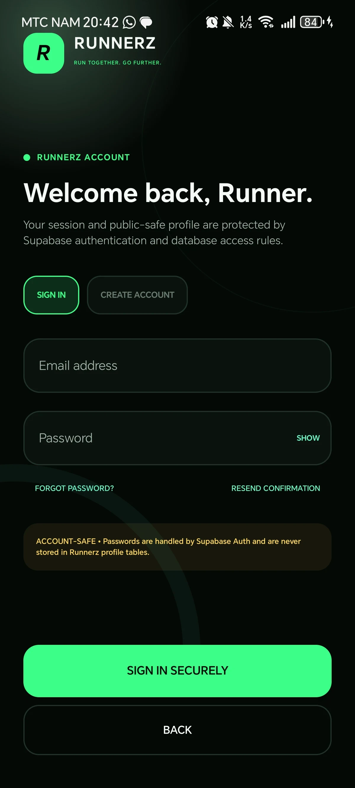 | 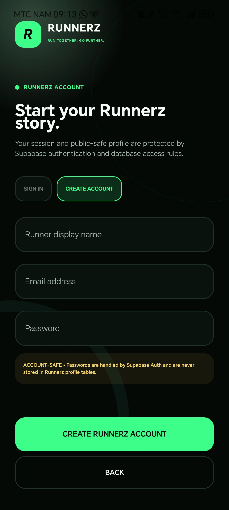 |

| Password recovery | Authenticated password update |
|---|---|
| 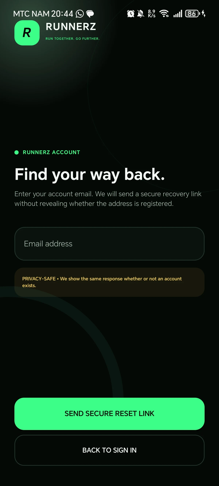 | 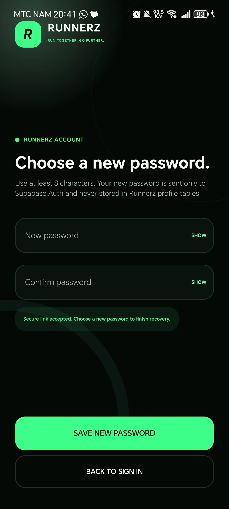 |

| Live Founder profile | Governed recognition | Privacy-safe share studio |
|---|---|---|
| 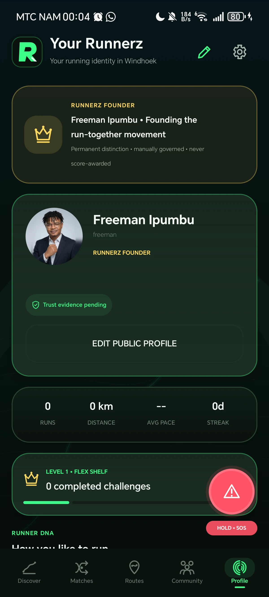 | 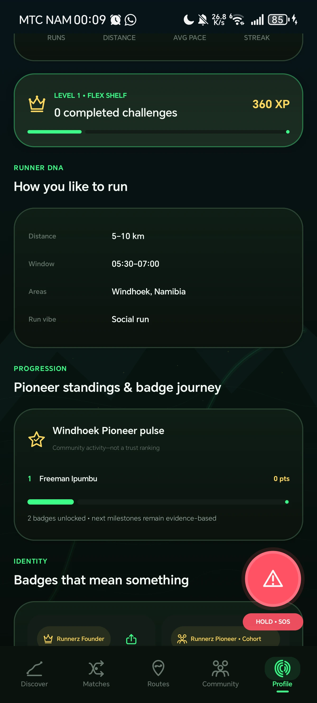 | 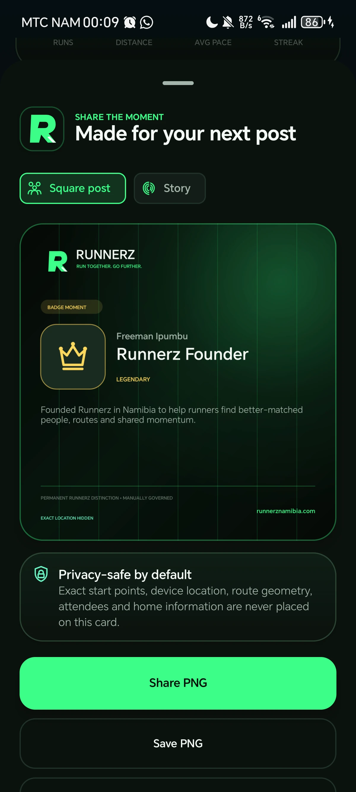 |

| Ranked meetup options on the live route map |
|---|
| 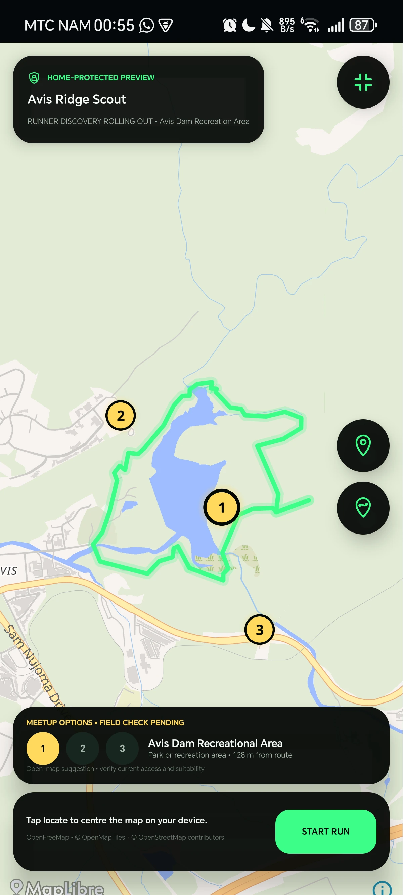 |

| Onboarding trust choices | Founder welcome | Founder’s Corner |
|---|---|---|
| 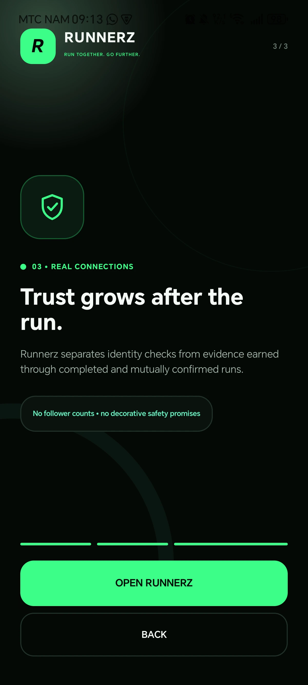 |  | 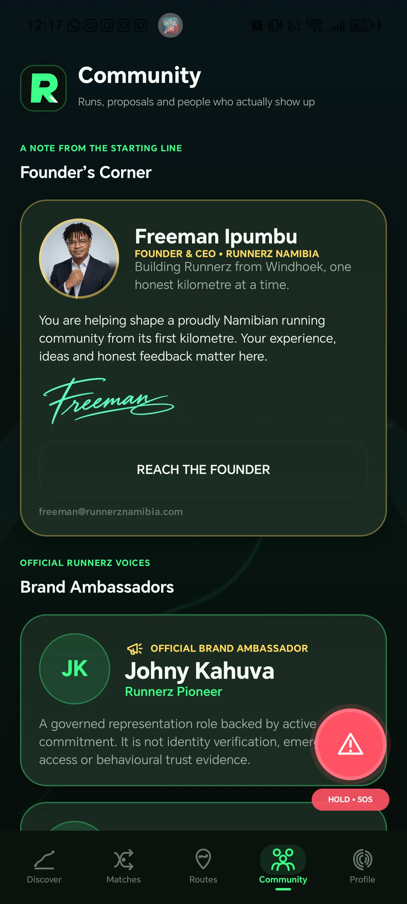 |

| 1.1.0 controlled signature trail on HONOR REA-NX9 |
|---|
|  |

The earlier gallery images use the physical Android 1.0.10 field-test capture
set, including the revised timer-only completion state. The new unaltered
capture used **real Eros Urban Arc route geometry** and sent **60 deterministic,
realistic accepted fixes** through the **production tracking and metrics path**
on a **HONOR REA-NX9**. It shows **0.18 km**, current and average pace,
estimated gain and **two lime `#39FF88` trail segments** across a pause/resume
boundary. The simulated run was never finished or banked. This is controlled
handset evidence, not an outdoor GNSS accuracy or completed-run claim. The
“5 TEST RUNNERS” route-preview label is Field Test fixture content, not live
nearby activity. New Running Nearby and Banked Miles captures, plus outdoor
tracking acceptance, remain gated on the final walkthrough.

Planned route distance is never presented as kilometres banked. Rankings use
device-recorded aggregate sessions that pass server plausibility checks; they
are not race-verified or anti-tamper-attested results.

## Product atmosphere


The visual system uses near-black, electric green, white and mint with a restrained gold signal. It is performance technology with Namibian warmth—not generic fitness imagery or imported cyberpunk decoration.

## Route Lab


The public catalogue includes route studies across Avis, Eros, Olympia, Brakwater, Windhoek Central, Auasblick, Ludwigsdorf, Katutura, Khomasdal, Dorado Park, Pioneerspark, Suiderhof, Kleine Kuppe, Academia, Hochland Park and Cimbebasia.

Geometry is genuine routed open data. Access, lighting, water, road conditions
and safety remain explicitly marked for local field verification. In the
Android candidate, selecting a route provides proximity context only and never
rewrites the runner's recorded GPS trail or distance.

## Engineering overview

- React 19 and TypeScript
- Vinext and Vite
- MapLibre with self-hosted PMTiles, fonts and sprites
- Protomaps/OpenStreetMap attribution and BRouter route studies
- DigitalOcean App Platform deployment behind Cloudflare DNS and edge controls
- Responsive route metadata and map rendering
- Content Security Policy and conservative browser-security headers
- Optimised WebP media and deferred below-the-fold assets
- Structured consent, duplicate prevention and abuse-protection foundations
- Named-operator authorization and database-enforced multi-factor assurance
- Private workflow state with append-only, cryptographically linked audit evidence

## Operations is part of the product

Launching the public surface created a second design problem: interest is only useful if the team can act on it responsibly.

I designed Runnerz Command as a deliberately single-account control room for the Founder. It turns Insider demand, live community signals and follow-up decisions into one restrained operational workflow. Each contact can be reviewed, prioritised, scheduled and annotated; operational and audit datasets can be exported without exposing any management surface to ordinary Runnerz accounts.

The control model is defence in depth: a valid account, an explicit private allowlist and a fresh authenticator-backed session are all required. The data layer rejects password-only sessions even if the interface is bypassed. Contact details remain with the email provider while the database stores only the minimum workflow state needed for accountable operations.

## Design science loop

```text
LOCAL PROBLEM → PRODUCT THESIS → INTERACTIVE ARTEFACT →
BROWSER + DEVICE EVALUATION → SAFETY CORRECTION → HARDENED RELEASE
```

## Current status

The official website is live at
[runnerznamibia.com](https://runnerznamibia.com). DigitalOcean App Platform
runs the origin behind Cloudflare DNS, TLS and edge controls. The production
verification suite covers public routes, legal/support/deletion pages,
security headers, health and weather contracts, sitemap coverage, route
studies, PMTiles byte-range delivery, canonical-host behaviour and anonymous
rejection at the operations boundary.

The Route Lab now exposes 27 distinct Windhoek studies while keeping field verification explicit. Rocky Crest, Wanaheda and Luxury Hill were added through the same BRouter/OpenStreetMap pipeline; candidates without two credible public-place meetups inside 500 metres were rejected. The Insider journey has validation and confirmation mail, and the product gallery uses physical-device captures spanning signup and recovery, ranked meetup-map options, an owner-controlled Founder profile, governed recognition and privacy-safe square/Story exports.

The live site carries the complete 21-item `Coming soon` merchandise concept
gallery and its consented interest signal. The flow takes no payment and makes
no preorder, price, stock, reservation or allocation promise. The music player
remains a separate digital product, not a 22nd catalogue item. The public
community story reserves sponsor/event/editorial space without presenting any
bank, brand or event partner as confirmed.

The current public privacy notice explains device-local exact trails and the
displayed-area requests made to the OpenFreeMap/OpenStreetMap-based map service.
The account-deletion page documents both the signed-in Settings route and a
public request route. This canonical privacy/account-deletion release passed
**77/77** live production checks. That result is the verified website baseline
from before the pending Android 1.1.0 product-copy promotion; it is not evidence
that the 1.1.0 app update or its final screenshots are already live.

The Android 1.1.0 / code 15 candidate has source/build evidence for both Live
and Field Test flavours: **260 unit tests passed total** (130 per flavour),
**zero lint errors**, and application plus instrumentation packages assembled.
The controlled HONOR REA-NX9 simulation above additionally exercised the
production tracking and metrics path on real route geometry with 60 accepted
fixes, 0.18 km and two lime trail segments. The candidate includes accepted-fix
live tracking, route-selected starts, non-snapping route proximity,
account-scoped Banked Miles, broad-area Running
Nearby, report/block controls, invitation-led women-only runs, current-document
legal reacceptance and a restrained UNIFIED 20 handoff.

That Android evidence is not final release acceptance. Outdoor GNSS movement and
poor-signal testing, screen-off provider continuity and OEM background behaviour,
battery sampling, multi-account hosted checks, paired Wear OS notification
mirroring and the complete UNIFIED round trip remain open. Store acceptance,
including a signed Play artifact, Play Console declarations and reviewer
materials, also remains open. Notification mirroring is not a native Wear OS
app, and this Android repository contains no iOS, watchOS, Apple signing or TestFlight
product; Apple platforms require separate implementations.

## Repository boundary

No application source, PMTiles archive, environment file, API implementation, production identifier, subscriber data or deployment configuration is included here.

Security concerns should be sent privately to [info@runnerznamibia.com](mailto:info@runnerznamibia.com).

---

© 2026 Runnerz Namibia. Product and brand material is shared for portfolio viewing. No licence is granted to reproduce the product, identity or documentation.
